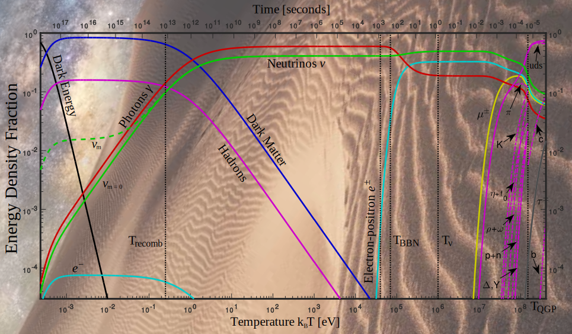

# thesis-collab-project
Quarks to Cosmos: Particles and Plasma in Cosmological Evolution

## abstract
We describe in the context of the particle physics (PP) standard model (SM) `PP-SM' the understanding of the primordial properties and composition of the Universe in the temperature range $130\ \mathrm{GeV}>T>20\ \mathrm{keV}$. The Universe evolution is described using FLRW cosmology. In the considered temperature range the unknown cold dark matter and dark energy content of $\Lambda\mathrm{CDM}$ have a negligible influence allowing a reliable understanding of physical properties of the Universe based on PP-SM energy-momentum alone. We follow the arrow of time in the expanding and cooling Universe: After the PP-SM heavies $(t, H, W, Z)$ diminish in abundance below $T\simeq 50\,\mathrm{GeV}$, the PP-SM plasma in the Universe is governed by the strongly interacting Quark-Gluon content. Once the temperature drops below $T\simeq 150\ \mathrm{MeV}$, quarks and gluons hadronize into strongly interacting matter particles comprising a dense baryon-antibaryon content. Rapid disappearance of baryonic antimatter ensues, which adopting the present day photon-to-baryon ratio completes at $T_\mathrm{B}=38.2\ \mathrm{MeV}$. We study the ensuing disappearance of strangeness and mesons in general. We show that the different eras defined by particle populations are barely separated from each other with abundance of muons fading out just prior to $T=\mathcal{O}(2.5)\ \mathrm{MeV}$, the era of emergence of the free-streaming neutrinos. We develop methods allowing the study of the ensuing speed of the Universe expansion as a function of fundamental coupling parameters in the primordial epoch. We discuss the two relevant fundamental constants controlling the decoupling of neutrinos. We subsequently follow the early Universe as it passes through the hot dense electron-positron plasma epoch. The high density of positron antimatter disappears near $T=20.3\ \mathrm{keV}$, well after the Big Bang nucleosynthesis era: Nuclear reactions occur in the presence of a highly mobile and relatively strongly interacting electron-positron plasma phase. We apply plasma theory methods to describe the strong screening effects between heavy dust particle (nucleons). We analyze the paramagnetic characteristics of the electron-positron plasma when exposed to an external primordial magnetic field.

## authors
<a
id="cy-effective-orcid-url"
class="underline"
href="https://orcid.org/0000-0001-8217-1484"
target="orcid.widget"
rel="me noopener noreferrer"
style="vertical-align: top"> Johann Rafelski</a>, <a
id="cy-effective-orcid-url"
class="underline"
href="https://orcid.org/0000-0002-2289-4856"
target="orcid.widget"
rel="me noopener noreferrer"
style="vertical-align: top"> Jeremiah Birrell</a>, <a
id="cy-effective-orcid-url"
class="underline"
href="https://orcid.org/0000-0001-9985-1822"
target="orcid.widget"
rel="me noopener noreferrer"
style="vertical-align: top"> Christopher Grayson</a>, <a
id="cy-effective-orcid-url"
class="underline"
href="https://orcid.org/0000-0001-5474-2649"
target="orcid.widget"
rel="me noopener noreferrer"
style="vertical-align: top"> Andrew Steinmetz</a>, <a
id="cy-effective-orcid-url"
class="underline"
href="https://orcid.org/0000-0001-5038-8427"
target="orcid.widget"
rel="me noopener noreferrer"
style="vertical-align: top"> Cheng Tao Yang</a>

## cite as
Rafelski, J., Birrell, J., Grayson, C., Steinmetz, A., Yang, C. T. Quarks to Cosmos: Particles and Plasma in Cosmological evolution. arXiv preprint arXiv:2409.19031 [hep-ph] (2024).

## doi/arXiv id
* https://arxiv.org/abs/2409.19031

## license
Copyright © 2024, the authors, under exclusive licence to Springer Science Business Media, LLC, part of Springer Nature.
